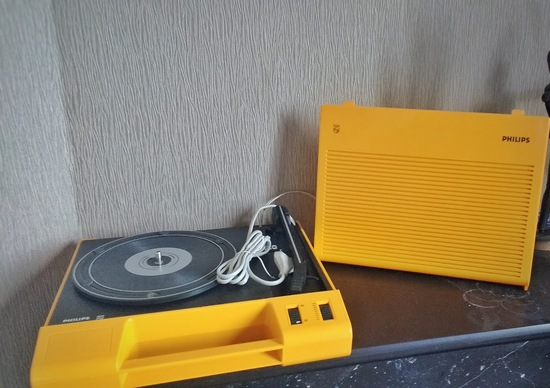
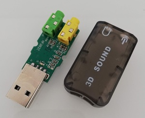

# BTurntable

## Making an old turntable connect to a bluetooth speaker

### Intro
 

When my nice yellow Philips turntable (AF180) broke I was very sad and decided to fix it, but instead of fixing the old electronic components I had an idea: why not connect my turntable to a Bluetooth speaker ? 

Turntable devices can be adapted with a [RIAA phono preamplifier](http://sound.whsites.net/project06.htm)  who is a perfect match but these modules are usually expensive

Instead of buying relatively expensive electronics (RIAA module + power supply), I decided to try a cheap solution : *An cheap USB audio adapter*

As the turntable's cartridge produce very small voltage levels (uV ~ mV ) the mic preamp inside the USB adapter is certainly not a perfect match but  it worked very well after my first tests.

Once we are in digital domain we can improve sound quality by doing some equalization,  noise removal and everything we want, including RIAA equalization. We can do it all these with a swiss knife called SoX

### Parts

* A Raspberry PI zero or a Raspberry PI 3
* Any Audio USB Adapter that works on linux
* 3.5 mm mono jack cable 

### Wiring

 * *Cartridge* : As we want to send audio over a small bluetooth speaker, it makes no sense separating left and right channels from the cartridge. We must mix the two channels by shorting both wires into a single one. This wire will have a signal mixed from two channels. An advantage is that doing this approach we'll need a single audio usb adapter instead of two. As mic input is always mono this approach will carry the mixed signal into the mic input

 

 * *Ground* : To avoid noise make sure that all grounds are connected together, even the wire coming from the outlet. Don't forget to connect all these on the turntable's metal case

** *3.5 mm jack cable*
 
