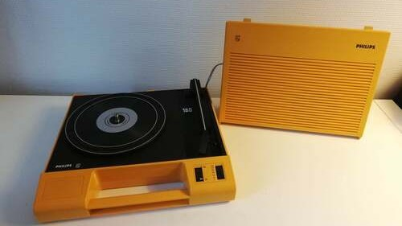
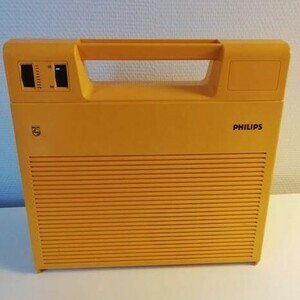
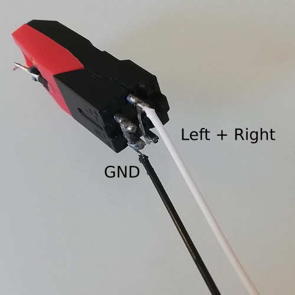
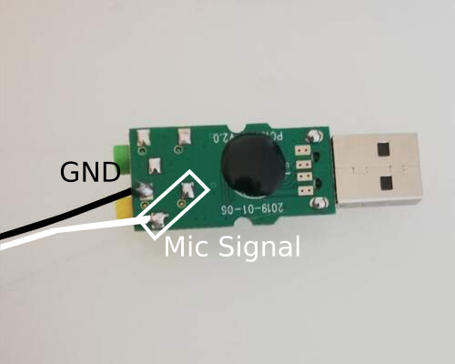
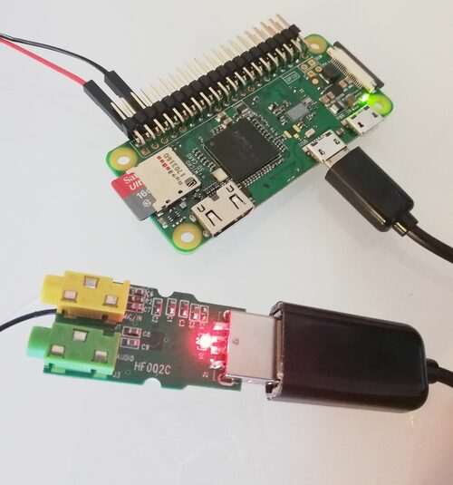

# BTurntable : Making a vintage turntable connect to a bluetooth speaker


### Intro
 
 


When my nice yellow philips vinyl turntable (AF180) broke I was very sad and decided to fix it, but instead of fixing the old electronic components I had an idea: why not connect my turntable to a Bluetooth speaker ? 

Turntable devices can be adapted with a [RIAA phono preamplifier](http://sound.whsites.net/project06.htm)  who is a perfect match but these modules are usually expensive

Instead of buying relatively expensive electronics (RIAA module + power supply), I decided to try a cheap solution  ( ~ $2 ) : *An USB audio adapter*


As the turntable's cartridge produce very small voltage levels (uV ~ mV ) the mic preamp inside the USB adapter is certainly not a perfect match but **it worked very well after my first tests**.
Once we're in digital domain we can improve sound quality by doing some equalization,  noise removal and everything we want, including RIAA equalization. We can do it all these with a swiss knife called SoX

The main advantage of this approach is that if you have a bt speaker (almost sure!) you can build this system for less than $20 (rpi zero + audio usb adapter)

### Parts

* A Raspberry PI zero or a Raspberry PI 3
* Any Audio USB Adapter that works on linux
* Micro-usb to usb female adapter cabe 

### Wiring

 * **Cartridge** : As we want to send audio over a small bluetooth speaker, it makes no sense separating left and right channels from the cartridge. We must mix the two channels by shorting both wires into a single one. This wire (white on the image) has a signal mixed from two channels. By doing this approach we'll need a single audio usb adapter instead of two as mic input is mono

 

 * **USB Audio adapter** : The Mic input of the usb audio adapter has only one input wire who is shorted as shown on the image, the two tap points (white rectangle) are the same wire on the adapter.
 

 
 * **Rpi connections** : 

 


 * **Ground** : To avoid noise make sure that all grounds are connected together, even the wire coming from the outlet. Don't forget to connect all these on the turntable's metal case


### Installing Dependencies

I decided to use alsa because pulseaudio was not responsive and gave big latency in my tests

On the Raspberry pi : 
``` 
 apt install bluez-alsa sox
```

### Running 

#### Pairing and connecting the bt speaker 

```
#bluetoothctl
[bluetooth]# agent on
Agent registered
[bluetooth]# scan on

XX:XX:XX:XX:XX #our speaker 

[bluetooth]# pair XX:XX:XX:XX:XX

[bluetooth]# trust XX:XX:XX:XX:XX

[bluetooth]# connect XX:XX:XX:XX:XX
```


#### Volume control 


 

